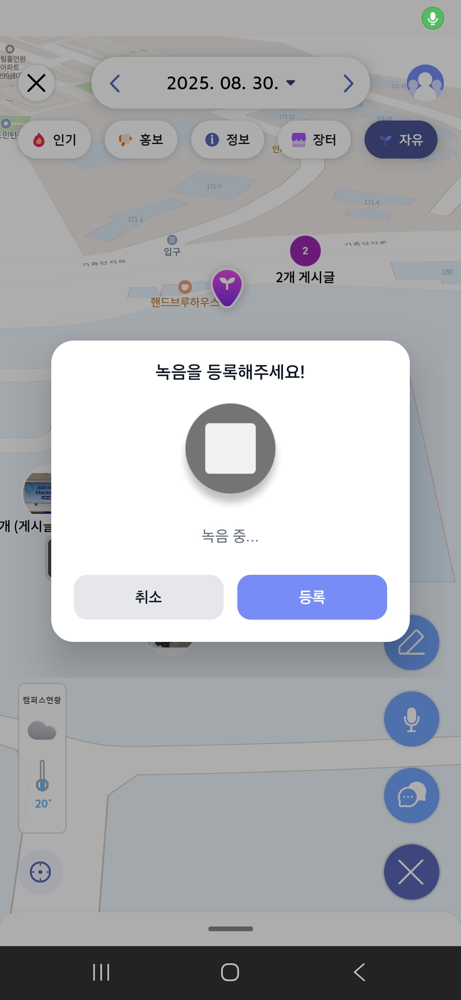

<div align="center">

# 🗺️ CAMPUNG!
우리학교 **지도 기반 커뮤니티**


</div>

---

## ✍️ 개요

> 헤이영 캠퍼스의 커뮤니티 활성화를 위해 **지도 기반 커뮤니티 기능과 게시판을 연동**하여 온·오프라인 소통 강화

- **서비스명:** CAMPUNG!
- **프로젝트 기간:** 2025.08.13 ~ 2025.08.30 (신한 해커톤 with SSAFY)
- **핵심 가치:** 위치 중심의 즉각 소통(지도) × 축적 가능한 정보(게시판)
- **포지셔닝:** 학교 커뮤니티의 **현장성**을 지도에서, **지속성**을 게시판에서

<div align="center">


<p>

</p>

</div>

---

## 📚 목차

- [프로젝트 소개](#-프로젝트-소개)
- [✨ 기술적 특징](#-기술적-특징)
- [⚙️ 기술 스택](#️-기술-스택)
- [⚒️ 시스템 아키텍처](#️-시스템-아키텍처)
- [Android 패키지 구조](#android-패키지-구조)
- [BackEnd 패키지 구조](#backend-패키지-구조)
- [프로젝트 산출물 및 매뉴얼](#프로젝트-산출물-및-매뉴얼)
- [팀원 소개](#팀원-소개)

---

## 🧭 프로젝트 소개

- **문제**: 텍스트 게시판 중심의 학교 커뮤니티는 즉시성·현장감에 한계가 있음
- **해결**: 지도 위에서 **지금, 여기**의 정보를 빠르게 주고받고, 중요한 내용은 **게시판에 구조화**해 남깁니다
- **핵심 시나리오**
  - 분실물/행사/랜선플리 마감/맛집 등 **현장 이슈**를 지도에서 즉시 공유
  - 게시판과 연동되어 **검색·보관·회고**가 용이
  - **친구 위치 공유** 및 **랜드마크**로 교내 활동성 강화

---

## 📽️ 주요 기능 시연


### 1️⃣ 홈화면


### 2️⃣ 지도 화면


### 3️⃣ 게시글 리스트


### 4️⃣ 게시글 작성


### 5️⃣ 게시글 상세 조회


### 6️⃣ 녹음 기능



### 7️⃣ 친구 위치 공유


### 8️⃣ 랜드마크


---

## ✨ 기술적 특징

1. **지도 렌더링 최적화 – QuadTree × 마커 풀링**
   - 전수 비교 대신 **공간 분할(QuadTree)** 로 근접 노드만 탐색 → 연산량 대폭 절감
   - **마커 풀 재사용**으로 객체 생성/GC 비용 감소, 프레임 드랍 완화
   - **코루틴 점진 렌더링**으로 대량 마커도 끊김 없이 표시

2. **지오해시 기반 근접 탐지 & 푸시**
   - 사용자 위치를 **지오해시 셀**로 관리, 셀 진입/이탈 시 관심 콘텐츠 구독 변경
   - 불필요한 네트워크/연산을 억제하고 **실시간성 유지**

3. **지도↔게시판 유기적 연동**
   - 지도에서 발생한 컨텍스트(위치·시간·사진·녹음)를 **게시글 메타데이터로 자동 연결**
   - 게시판 정렬/검색/필터에 위치 요소 결합 → **현장성 + 축적성** 동시에 달성

4. **안드로이드 UX 요소**
   - **커스텀 툴팁**(글래스모피즘) + **스케일 인/아웃 애니메이션**
   - **커스텀 바텀시트·데이트피커**, **Lottie 캐릭터**

5. **백엔드 안정화 & 알림**
   - JWT 기반 보안, FCM 알림, 친구·랜드마크·게시글 도메인 분리
   - 배포 자동화(CI/CD), 헬스체크/모니터링 구성

---

## ⚙️ 기술 스택

<!-- Campung 기술 스택 -->
<table>
  <tr>
    <th>분류</th>
    <th>기술 스택</th>
  </tr>

  <!-- 모바일(Android) -->
  <tr>
    <td><b>모바일(Android)</b></td>
    <td>
      
      
      
      
    </td>
  </tr>

  <!-- 백엔드 -->
  <tr>
    <td><b>백엔드</b></td>
    <td>
      
      
      
      
    </td>
  </tr>

  <!-- 네트워크·API -->
  <tr>
    <td><b>네트워크·API</b></td>
    <td>
      
      
      
      
      
      
    </td>
  </tr>

  <!-- 데이터베이스 -->
  <tr>
    <td><b>데이터베이스</b></td>
    <td>
      
      
      
      
    </td>
  </tr>

  <!-- 미디어·UI -->
  <tr>
    <td><b>미디어·UI</b></td>
    <td>
      
      
      
      
      
    </td>
  </tr>

  <!-- 인프라·DevOps -->
  <tr>
    <td><b>인프라·DevOps</b></td>
    <td>
      
      
      
      
      
      
    </td>
  </tr>

  <!-- 푸시알림·실시간 -->
  <tr>
    <td><b>푸시알림·실시간</b></td>
    <td>
      
      
    </td>
  </tr>

  <!-- 협업도구 -->
  <tr>
    <td><b>협업도구</b></td>
    <td>
      
      
    </td>
  </tr>
</table>

---

## ⚒️ 시스템 아키텍처


---

## Android 패키지 구조

```text
com.shinhan.campung
├── app                 # Application, MainActivity, 네비 그래프 엔트리 등
│   ├── CampungApplication.kt
│   └── MainActivity.kt
├── core                # 공통 유틸/설계 (모든 feature 에서 사용)
│   ├── common          # Result, Dispatcher, ErrorHandler, extension
│   ├── design          # Theme, Typography, 재사용 Compose UI
│   ├── location        # 위치 트래커/권한 헬퍼
│   └── notification    # 공용 알림 채널/헬퍼
├── data                # 외부/로컬 데이터 접근 구현부
│   ├── local           # Room, DataStore
│   ├── remote          # Retrofit, Interceptor, api/dto/mapper
│   ├── repository      # Repository 구현
│   └── service         # FCM, ForegroundService 등
├── domain              # 비즈니스 규칙(플랫폼 독립)
│   ├── model           # 순수 모델
│   ├── repository      # 인터페이스(포트)
│   └── usecase         # 유스케이스(Interactor)
├── di                  # Hilt 모듈들(NetworkModule, DatabaseModule…)
├── feature             # 기능 단위 UI + VM (screen 묶음)
│   ├── auth
│   ├── home
│   ├── map
│   ├── content         # list/detail
│   ├── recording
│   ├── profile
│   └── settings
├── navigation          # 앱 전역 NavHost, route 정의
└── util                # (가능하면 core/common 으로 흡수)
```

---

## BackEnd 패키지 구조

```text
com.shinhan.campung
├── app                  # 부팅/전역 설정
│   ├── config           # WebMvc, Jackson, CORS, Swagger, QueryDSL, i18n
│   ├── security         # JWT, SecurityFilterChain, AuthProvider
│   ├── exception        # GlobalExceptionHandler, ErrorCode
│   └── util             # Clock, IdGenerator 등
├── common               # 공용 DTO/이벤트/매퍼
├── core                 # 인프라 어댑터(외부 연동 공용)
│   ├── persistence      # BaseEntity, Auditing, SoftDelete
│   ├── cache            # RedisConfig, CacheManager
│   └── external         # 외부 API 클라이언트(WebClient/Feign)
├── feature              # 기능 모듈(api/application/domain/infrastructure)
│   ├── auth
│   ├── user
│   ├── content          # 게시글/댓글/좋아요
│   ├── recording        # 감정 기록, 음성/텍스트 요약
│   ├── location         # 위치, 지오해시, 캠퍼스 존
│   ├── notification     # 알림 구독, 토큰, 푸시 발송
│   └── admin            # 관리자/통계/모니터링
└── support              # 배치/스케줄/헬스체크/테스트 픽스처
    ├── batch            # Spring Batch
    ├── scheduler        # 집계·청소 작업
    └── monitor          # Actuator 확장, HealthIndicator
```

---

## 프로젝트 산출물 및 매뉴얼

- 포팅 매뉴얼: `exec/` 폴더 참고
- 기능 명세서: (링크 추가)
- 와이어프레임: (링크 추가)
- API 명세서: (링크 추가)
- ERD: (링크 추가)
- 시퀀스 다이어그램: (링크 추가)
- 간트 차트: (링크 추가)
<!-- 외부 링크가 있다면 위 괄호에 실제 URL을 채워주세요. -->

---

## 팀원 소개

| 박승균 | 오승연 | 박경찬 | 이상헌 | 김재환 |
|---|---|---|---|---|
|  |  |  |  |  |
| **리드/프론트**<br/>- 깃 관리<br/>- 마커·클러스터링·애니툴팁<br/>- 근처 게시글 탐지 | **프론트**<br/>- 네이버맵 커스텀<br/>- 회원/로그인<br/>- 글·녹음 등록·UI 최적화 | **프론트**<br/>- 커스텀 바텀시트/데이트피커<br/>- FCM 알림<br/>- 컨텐츠 상세/애니메이션 | **프론트**<br/>- 랜드마크 관리<br/>- Lottie 캐릭터<br/>- 친구/알림 기능 | **백엔드/인프라**<br/>- Linux·AWS S3·CI/CD<br/>- API 구현<br/>- AI/온도·날씨 집계 |

---
